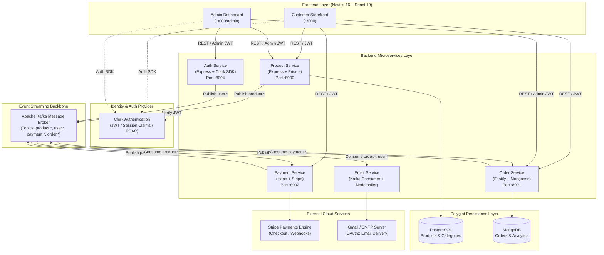

# BH Shop Microservices Documentation

Welcome to the official technical documentation for **BH Shop Microservices** — a modern, production-grade e-commerce platform built as an event-driven distributed system within a high-performance **Turborepo** monorepo.

---

## 📚 Documentation Index

Explore the detailed architectural and operational guides below:

| Document | Description |
| :--- | :--- |
| **[System Architecture Overview](./system-architecture.md)** | End-to-end system topology, communication protocols, synchronous vs. asynchronous boundaries, client apps, and security architecture. |
| **[Domain & Service Breakdown](./services-breakdown.md)** | Deep dive into each application (`modern-e-commerce`, `product-service`, `order-service`, `payment-service`, `auth-service`, `email-service`) and shared packages (`@repo/types`, `@repo/kafka`, `@repo/*-db`). |
| **[Event-Driven Architecture & Kafka](./event-driven-architecture.md)** | Message broker design, topic catalog, event payload contracts, choreography flows, consumer groups, idempotency, and in-memory test harness. |
| **[Data Management & Polyglot Persistence](./data-management.md)** | PostgreSQL (Prisma) vs. MongoDB (Mongoose) persistence models, schemas, aggregations, transactional boundaries, and eventual consistency. |
| **[Deployment, Docker & DevOps](./deployment-and-devops.md)** | Multi-stage Docker containerization with `turbo prune`, Docker Compose local orchestration, Turborepo caching, and GitHub Actions CI/CD workflows. |

---

## 🏛️ High-Level System Landscape

---

## 🚀 Quick Navigation

- **Running the Monorepo**: See [Getting Started in README.md](../README.md#getting-started--local-development).
- **Docker Compose Setup**: See [Deployment Guide](./deployment-and-devops.md#local-multi-service-orchestration).
- **Kafka Event Specifications**: See [Event Catalog](./event-driven-architecture.md#event-topic-catalog--schema-contracts).
- **Database Schema Reference**: See [Data Management Guide](./data-management.md).
