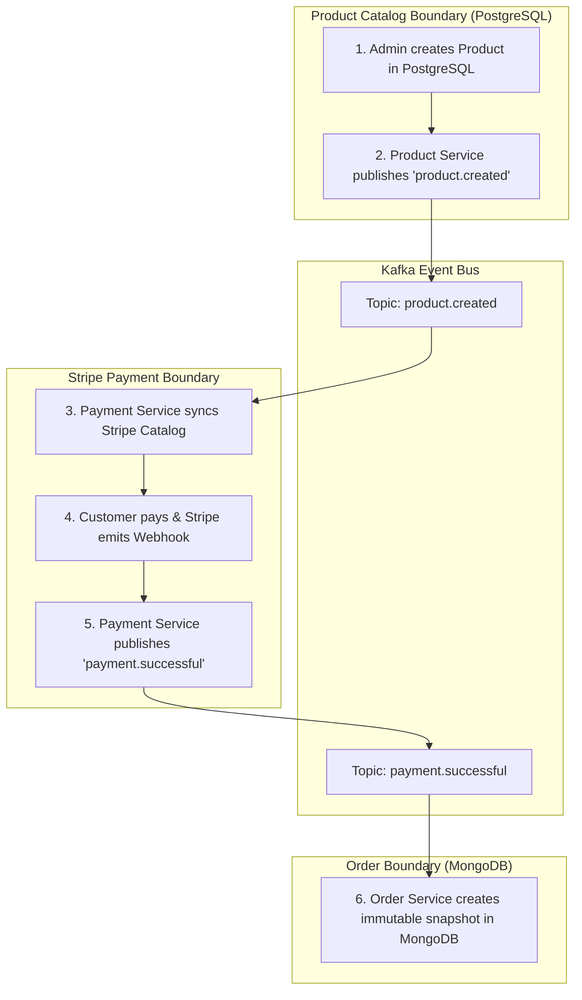

# Data Management & Polyglot Persistence

This document details the data management architecture of **BH Shop**, explaining the polyglot persistence strategy, relational modeling in **PostgreSQL (Prisma)**, document modeling in **MongoDB (Mongoose)**, and distributed data consistency across microservices.

---

## 1. Polyglot Persistence Strategy

Rather than forcing an entire distributed system into a single database model, BH Shop applies **polyglot persistence** — selecting the best data store for each domain's query patterns, consistency requirements, and data shapes:

| Domain | Database Engine | ODM / ORM | Data Model Characteristics | Rationale |
| :--- | :--- | :--- | :--- | :--- |
| **Catalog & Categories** | PostgreSQL 16 | Prisma ORM (`@repo/product-db`) | Relational, strict foreign keys, unique slug indexing | Product catalog requires strict schemas, referential integrity between categories and products, and deterministic relational filtering. |
| **Orders & Fulfillment** | MongoDB 7 | Mongoose (`@repo/order-db`) | Document-based, embedded array snapshots, time-series aggregations | Orders require fast append operations and point-in-time product snapshots that never change even if product catalog updates later. |
| **Identity & Access** | Clerk Cloud | Clerk SDK | Managed Auth, OAuth, JWTs, role metadata | Eliminates security liability of storing sensitive passwords or credentials locally. |
| **Payment Ledger** | Stripe Engine | Stripe API | Managed PCI-DSS compliant payment intents and charges | Guarantees compliance and payment token security without local financial data storage. |

---

## 2. PostgreSQL & Prisma: Catalog Domain (`@repo/product-db`)

### 2.1 Prisma Schema (`packages/product-db/prisma/schema.prisma`)

```prisma
datasource db {
  provider = "postgresql"
}

generator client {
  provider = "prisma-client"
  output   = "../generated/prisma"
}

model Product {
  id               String   @id @default(uuid())
  name             String
  shortDescription String
  description      String
  price            Float
  sizes            String[]
  colors           String[]
  images           Json     // Maps each color variant to its specific image URL
  createdAt        DateTime @default(now())
  updatedAt        DateTime @updatedAt
  categorySlug     String
  category         Category @relation(fields: [categorySlug], references: [slug])
}

model Category {
  id        String    @id @default(uuid())
  name      String
  slug      String    @unique
  products  Product[]
  createdAt DateTime  @default(now())
  updatedAt DateTime  @updatedAt
}
```

### 2.2 Key Catalog Architectural Decisions
1. **UUID Primary Keys**: Prevents ID enumeration attacks and facilitates distributed ID generation without centralized database coordinate locks.
2. **Variant Image Mapping in JSON**: `images` stores a JSON object keyed by color (e.g., `{"Black": "https://...", "Silver": "https://..."}`), ensuring flexible variant imagery without bloated join tables.
3. **Category Slug Relations**: Products link directly to `Category.slug`, enabling clean SEO URLs (`/products?category=electronics`) without extra ID translation queries.

---

## 3. MongoDB & Mongoose: Orders Domain (`@repo/order-db`)

### 3.1 Order Schema (`packages/order-db/src/order.model.ts`)

```typescript
import mongoose, { InferSchemaType, model } from "mongoose";

const { Schema } = mongoose;
export const OrderStatus = ["success", "failed"] as const;

const OrderSchema = new Schema(
  {
    userId: { type: String, required: true },
    email: { type: String, required: true },
    amount: { type: Number, required: true },
    status: { type: String, required: true, enum: OrderStatus },
    products: {
      type: [
        {
          name: { type: String, required: true },
          quantity: { type: Number, required: true },
          price: { type: Number, required: true },
        },
      ],
      required: true,
    },
  },
  {
    timestamps: true, // Automatically manages createdAt and updatedAt
  },
);

export type OrderSchemaType = InferSchemaType<typeof OrderSchema>;
export const Order = model("Order", OrderSchema);
```

### 3.2 Key Order Architectural Decisions
1. **Immutable Product Snapshotting**: Instead of storing foreign keys to PostgreSQL product IDs, the order document embeds an immutable array of `{ name, quantity, price }`. If a product's price or description changes in PostgreSQL later, historical orders remain financially accurate.
2. **MongoDB Aggregation Pipeline for Analytics**:
   The `order-service` executes multi-stage aggregation pipelines on `/order-chart` to calculate monthly sales volume and success rates for the admin dashboard:

   ```typescript
   const raw = await Order.aggregate([
     {
       $match: {
         createdAt: { $gte: sixMonthAgo, $lte: now },
       },
     },
     {
       $group: {
         _id: {
           year: { $year: "$createdAt" },
           month: { $month: "$createdAt" },
         },
         total: { $sum: 1 },
         successful: {
           $sum: { $cond: [{ $eq: ["$status", "success"] }, 1, 0] },
         },
       },
     },
     {
       $project: {
         _id: 0,
         year: "$_id.year",
         month: "$_id.month",
         total: 1,
         successful: 1,
       },
     },
     { $sort: { year: 1, month: 1 } },
   ]);
   ```

---

## 4. Distributed Data Consistency & Synchronization

In distributed microservice systems, maintaining data consistency without distributed transactions (such as Two-Phase Commit / 2PC) is critical for high availability and low latency.



- **Eventual Consistency**: All cross-service state updates (e.g., Stripe catalog updates and MongoDB order entries) achieve eventual consistency via Kafka events.
- **Service Isolation**: No service reads directly from another service's private database. All data sharing occurs via REST APIs or Kafka events adhering to `@repo/types`.
