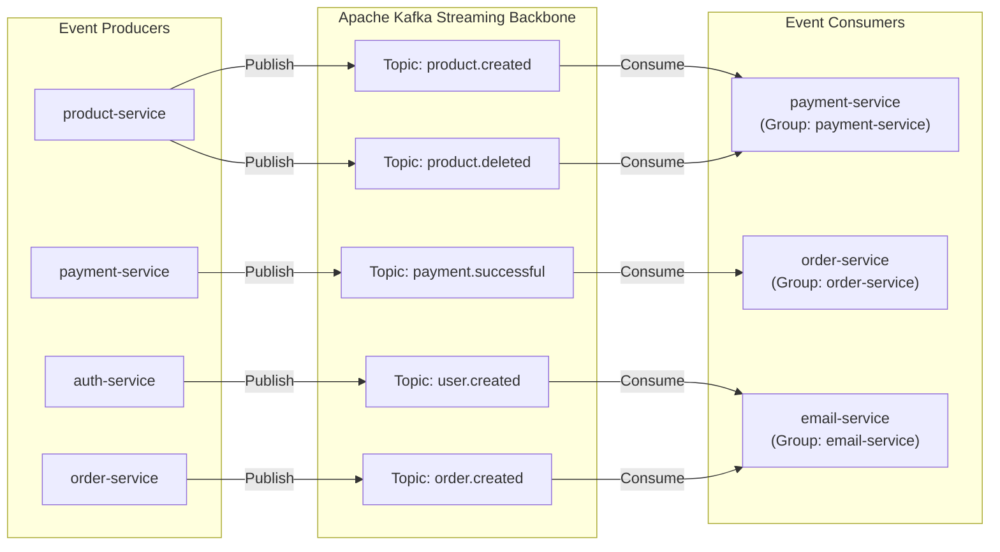
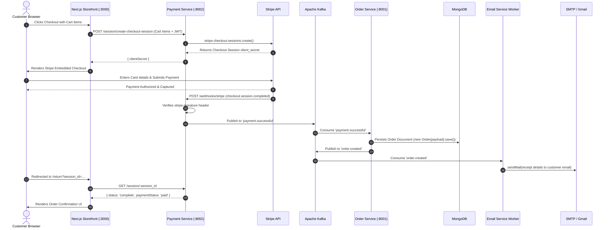
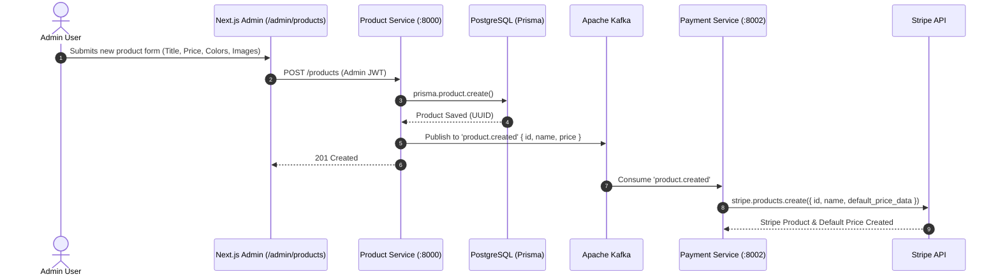

# Event-Driven Architecture & Apache Kafka

This document describes the asynchronous event-driven streaming architecture of **BH Shop**, explaining how **Apache Kafka** decouples microservices, standardizes message schemas, coordinates cross-service transactions, and guarantees event delivery.

---

## 1. Architectural Role of Apache Kafka

In a microservices ecosystem, direct synchronous HTTP calls between internal services introduce tight coupling, cascading latency, and single points of failure. BH Shop uses **Apache Kafka** as an event streaming backbone:

- **Decoupled Producers & Consumers**: Services emit domain events without knowledge of downstream consumers.
- **Durable Event Storage**: Messages are persisted across partitions, allowing consumers to process events at their own pace or replay past streams.
- **Scalable Consumer Groups**: Multiple instances of a service can share workload partitions under a unified `groupId`.



---

## 2. Event Topic Catalog & Schema Contracts

All Kafka messages use JSON-serialized payloads adhering to the types defined in `@repo/types`:

### 2.1 Topic: `product.created`
- **Producer**: `product-service` (when admin creates a new product)
- **Consumer**: `payment-service`
- **Purpose**: Creates corresponding product and price entities in Stripe's product catalog.
- **Payload Schema**:
  ```json
  {
    "id": "e4b2d184-7c2a-4efb-8d19-45e3d7cb5a81",
    "name": "Wireless Noise-Cancelling Headphones",
    "price": 299.99
  }
  ```

### 2.2 Topic: `product.deleted`
- **Producer**: `product-service` (when admin deletes a product)
- **Consumer**: `payment-service`
- **Purpose**: Deactivates or removes the corresponding product in Stripe.
- **Payload Schema**:
  ```json
  {
    "id": "e4b2d184-7c2a-4efb-8d19-45e3d7cb5a81"
  }
  ```

### 2.3 Topic: `user.created`
- **Producer**: `auth-service` (when admin provisions a new user)
- **Consumer**: `email-service`
- **Purpose**: Sends a personalized onboarding welcome email.
- **Payload Schema**:
  ```json
  {
    "username": "alex_doe",
    "email": "alex.doe@example.com"
  }
  ```

### 2.4 Topic: `payment.successful`
- **Producer**: `payment-service` (upon receiving verified Stripe webhook `checkout.session.completed`)
- **Consumer**: `order-service`
- **Purpose**: Persists customer order document in MongoDB and initiates fulfillment.
- **Payload Schema**:
  ```json
  {
    "userId": "user_2tX8y9Qz...",
    "email": "buyer@example.com",
    "amount": 29999,
    "status": "success",
    "products": [
      {
        "name": "Wireless Noise-Cancelling Headphones",
        "quantity": 1,
        "price": 29999
      }
    ]
  }
  ```

### 2.5 Topic: `order.created`
- **Producer**: `order-service` (after successfully saving order in MongoDB)
- **Consumer**: `email-service`
- **Purpose**: Sends an order confirmation and itemized receipt to the buyer.
- **Payload Schema**:
  ```json
  {
    "email": "buyer@example.com",
    "amount": 29999,
    "status": "success"
  }
  ```

---

## 3. End-to-End Choreography Sequences

### 3.1 Checkout, Payment Capture & Order Fulfillment



### 3.2 Product Creation & Stripe Catalog Synchronization



---

## 4. Reliability, Consumer Groups & Testing

### 4.1 Consumer Group Isolation
Each microservice is registered with a dedicated Kafka consumer group:
- `payment-service`: Independent offset tracking for `product.*` events.
- `order-service`: Independent offset tracking for `payment.successful`.
- `email-service`: Independent offset tracking for `order.created` and `user.created`.

### 4.2 In-Memory Kafka Test Harness (`InMemoryKafkaHarness`)
To enable fast, deterministic unit and integration tests in CI/CD without spinning up physical Kafka brokers, the shared `@repo/kafka` package includes `InMemoryKafkaHarness`:

```typescript
import { InMemoryKafkaHarness } from "@repo/kafka/test-harness";

const harness = new InMemoryKafkaHarness();

// Register asynchronous subscriber
harness.subscribe("payment.successful", async ({ value }) => {
  // process test event
});

// Produce message
await harness.send("payment.successful", { value: mockPaymentData });

// Assert recorded events
const events = harness.getAllEvents();
expect(events[0]?.topic).toBe("payment.successful");
```
