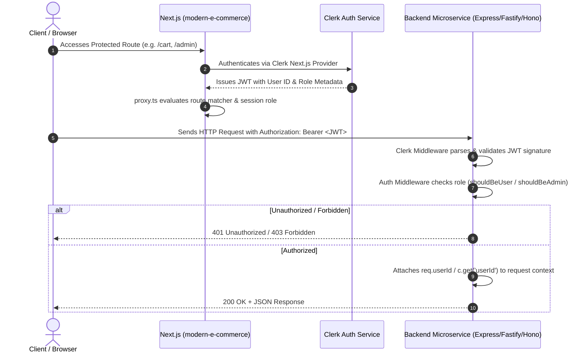

# System Architecture Overview

This document provides a comprehensive architectural breakdown of the **BH Shop Microservices** platform — outlining core architectural principles, component topologies, communication paradigms, security boundaries, and cross-cutting lifecycle flows.

---

## 1. Architectural Philosophy & Principles

The BH Shop platform is architected around the following foundational principles:

1. **Domain-Driven Service Boundaries**: Business capabilities are decoupled into self-contained microservices (`product-service`, `order-service`, `payment-service`, `auth-service`, `email-service`), each owning its logic, dependencies, and private storage engine.
2. **Polyglot Persistence**: The system does not enforce a single database paradigm. Structured catalog data with strict referential constraints resides in **PostgreSQL**, while fast-growing, append-heavy order streams reside in **MongoDB**.
3. **Event-Driven Choreography**: Services avoid fragile synchronous distributed chains. Cross-domain side-effects (such as catalog synchronization with Stripe, order fulfillment upon payment capture, and notification dispatch) are coordinated asynchronously over **Apache Kafka**.
4. **Unified Monorepo Workflow**: Code sharing (`@repo/types`, `@repo/kafka`, `@repo/*-db`, `@repo/eslint-config`, `@repo/typescript-config`), dependency orchestration, build pipeline execution, and parallel test runners are managed uniformly via **Turborepo** and **pnpm**.
5. **Zero-Trust Role-Based Access Control (RBAC)**: Authentication is centralized through **Clerk**, where claims and roles are verified at both the Next.js edge proxy layer and each microservice's inbound middleware guards.

---

## 2. End-to-End System Topology

```mermaid
graph TD
    subgraph ClientLayer["1. Client Layer (Next.js 16 App Router)"]
        Store["Customer Storefront<br/>• Catalog Browsing<br/>• Zustand Cart<br/>• Embedded Stripe Checkout"]
        Admin["Admin Management Portal<br/>• User Management<br/>• Product & Category CRUD<br/>• Order & Sales Recharts Analytics"]
    end

    subgraph SecurityBoundary["2. Identity & Access Management"]
        ClerkAuth["Clerk Identity Provider<br/>• Session Tokens & JWTs<br/>• Public/Admin Role Metadata<br/>• User Profile Management"]
    end

    subgraph ServiceMesh["3. Independent Microservice Network"]
        direction TB
        ProductSvc["📦 Product Service (:8000)<br/>• Express.js + Prisma ORM<br/>• Categories & Products CRUD<br/>• Produces: product.created, product.deleted"]
        OrderSvc["📋 Order Service (:8001)<br/>• Fastify + Mongoose ODM<br/>• User Orders & 6-Mo Analytics<br/>• Consumes: payment.successful<br/>• Produces: order.created"]
        PaymentSvc["💳 Payment Service (:8002)<br/>• Hono + @hono/node-server<br/>• Stripe Sessions & Webhook Ingestion<br/>• Consumes: product.created, product.deleted<br/>• Produces: payment.successful"]
        AuthSvc["🔐 Auth Service (:8004)<br/>• Express.js + Clerk Backend SDK<br/>• Admin User Management<br/>• Produces: user.created"]
        EmailSvc["📧 Email Service (Worker)<br/>• KafkaJS Consumer + Nodemailer<br/>• Consumes: user.created, order.created<br/>• Transactional Email Delivery"]
    end

    subgraph StreamingBus["4. Event Streaming Backbone"]
        KafkaBrokers["Apache Kafka Cluster<br/>Topics: product.created | product.deleted | user.created | payment.successful | order.created"]
    end

    subgraph DataStorage["5. Distributed Databases & External APIs"]
        PG[(PostgreSQL<br/>Product & Category Relational Data)]
        Mongo[(MongoDB<br/>Order Documents & Aggregation Pipelines)]
        StripeAPI["Stripe API & Webhooks"]
        GoogleSMTP["Google OAuth2 / SMTP Server"]
    end

    %% Client communication
    ClientLayer -->|Verify Auth Claims| SecurityBoundary
    Store -->|HTTP / REST (Port 8000)| ProductSvc
    Store -->|HTTP / REST (Port 8001)| OrderSvc
    Store -->|HTTP / REST (Port 8002)| PaymentSvc
    Admin -->|Admin REST (Port 8004)| AuthSvc
    Admin -->|Admin REST (Port 8000)| ProductSvc
    Admin -->|Admin REST (Port 8001)| OrderSvc

    %% Service to Storage
    ProductSvc --> PG
    OrderSvc --> Mongo
    PaymentSvc --> StripeAPI
    EmailSvc --> GoogleSMTP

    %% Service to Kafka
    ProductSvc -->|Publish| KafkaBrokers
    PaymentSvc -->|Publish| KafkaBrokers
    AuthSvc -->|Publish| KafkaBrokers
    OrderSvc -->|Publish| KafkaBrokers

    KafkaBrokers -->|Subscribe| PaymentSvc
    KafkaBrokers -->|Subscribe| OrderSvc
    KafkaBrokers -->|Subscribe| EmailSvc
```

---

## 3. Communication Paradigms

The platform utilizes two complementary communication protocols depending on consistency and coupling requirements:

### A. Synchronous REST APIs (Request / Response)
Used when the client requires immediate data or confirmation:
- **Product Retrieval & Filtering**: Next.js client queries `GET /products` and `GET /categories` on `product-service` (Port 8000).
- **Checkout Session Initialization**: Next.js client posts cart line items to `POST /session/create-checkout-session` on `payment-service` (Port 8002) to generate an embedded Stripe client secret.
- **Admin Management & Analytics**: Admin dashboard calls `GET /orders`, `GET /order-chart` on `order-service` (Port 8001) and `GET /users` on `auth-service` (Port 8004).

### B. Asynchronous Kafka Events (Publish / Subscribe)
Used for all cross-service state reconciliation and workflow orchestration:
- **Product Catalog Synchronization**: When `product-service` creates a product, it publishes `product.created`. `payment-service` consumes this message and registers the product & default price in the Stripe catalog.
- **Order Creation via Webhooks**: When Stripe captures payment, it posts `checkout.session.completed` to `payment-service`. The service verifies the signature and emits `payment.successful` to Kafka. `order-service` consumes this event to persist the new order in MongoDB.
- **Transactional Notifications**: When an order is saved, `order-service` emits `order.created`. `email-service` consumes the event and sends an HTML order confirmation receipt.

---

## 4. Security & Authentication Architecture

Authentication is unified across all microservices via **Clerk**:



### Authorization Middleware by Service Framework:
- **Express Services (`product-service`, `auth-service`)**: Utilizes `@clerk/express` middleware combined with custom `shouldBeUser` and `shouldBeAdmin` guards.
- **Fastify Service (`order-service`)**: Utilizes `@clerk/fastify` plugin with Fastify `preHandler` hooks.
- **Hono Service (`payment-service`)**: Utilizes `@clerk/hono` middleware with context getter `c.get('userId')`.
- **Frontend App (`modern-e-commerce`)**: Enforces Next.js route protection via `proxy.ts` (`clerkMiddleware`) checking role metadata (`claims.metadata.role`).

---

## 5. End-to-End User Lifecycles

### 5.1 Customer Purchase & Fulfillment Journey
1. **Catalog Exploration**: Customer browses products filtered by category, search query, color, and size options rendered via TanStack Query.
2. **Cart Management**: Customer adds items to the local Zustand cart store (persisted in `localStorage`).
3. **Checkout Initiation**: Customer navigates to checkout; the frontend submits cart items to `payment-service:8002/session/create-checkout-session`.
4. **Embedded Stripe Elements**: Stripe SDK initializes the payment element inside the Next.js page.
5. **Payment Capture**: Customer completes card payment. Stripe processes funds and fires webhook `checkout.session.completed`.
6. **Webhook Verification**: `payment-service` verifies `stripe-signature` using `STRIPE_WEBHOOK_SECRET` and produces `payment.successful` to Kafka.
7. **Order Persistence**: `order-service` consumes `payment.successful`, generates an order document in MongoDB, and emits `order.created`.
8. **Notification Dispatch**: `email-service` consumes `order.created` and transmits an order confirmation email via SMTP.
9. **Customer Confirmation**: Customer is redirected to `/return?session_id=...`, which verifies session status with `payment-service` and confirms successful payment.

### 5.2 Admin Catalog & User Administration Journey
1. **Admin Login**: Admin signs in with Clerk credentials carrying `role: "admin"`.
2. **Category & Product Management**: Admin creates categories and multi-color products with associated image URLs via `/admin/products`.
3. **Stripe Sync**: `product-service` persists product in PostgreSQL and emits `product.created` to Kafka. `payment-service` automatically provisions matching Stripe product and price records.
4. **Real-time Analytics**: Admin views the interactive Recharts dashboard showing 6-month sales aggregations computed dynamically by MongoDB pipelines in `order-service`.

---

## 6. Network Topology & Port Allocations

| Service / Component | Protocol | Internal Port | Environment URL Variable | Technology |
| :--- | :--- | :--- | :--- | :--- |
| **`modern-e-commerce`** | HTTP / React | `3000` | `NEXT_PUBLIC_APP_URL` | Next.js 16, React 19 |
| **`product-service`** | HTTP / REST | `8000` | `NEXT_PUBLIC_PRODUCT_SERVICE_URL` | Express.js, Prisma |
| **`order-service`** | HTTP / REST | `8001` | `NEXT_PUBLIC_ORDER_SERVICE_URL` | Fastify, Mongoose |
| **`payment-service`** | HTTP / REST | `8002` | `NEXT_PUBLIC_PAYMENT_SERVICE_URL` | Hono, Stripe SDK |
| **`auth-service`** | HTTP / REST | `8004` | `NEXT_PUBLIC_AUTH_SERVICE_URL` | Express.js, Clerk Backend |
| **`email-service`** | Kafka Consumer | N/A (Worker) | N/A | Node.js, Nodemailer |
| **`PostgreSQL`** | TCP / SQL | `5432` | `DATABASE_URL` | PostgreSQL 16 |
| **`MongoDB`** | TCP / BSON | `27017` | `MONGO_URL` | MongoDB 7 |
| **`Apache Kafka`** | TCP / Kafka | `9092` / `9094-9096` | `KAFKA_BROKERS` | Apache Kafka |
| **`ZooKeeper`** | TCP | `2181` | N/A | Apache ZooKeeper |
